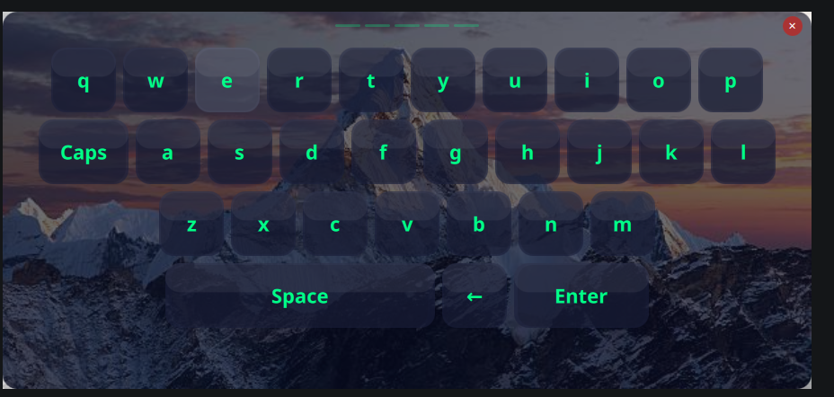

# KittyBoard

A hackable virtual keyboard for **Wayland**, built with **Qt 6 + QML**. It floats above your apps, looks however you want, and types into anything via `ydotool`.



## What it is

KittyBoard sits on your screen as a persistent overlay using `wlr-layer-shell`. It never steals focus — it just sends keys to whatever window is actually active. Drag it anywhere, theme it to hell, and type without a physical keyboard.

## Why it exists

- **Wayland-native** — layer-shell overlay, not a weird popup window
- **No focus theft** — your target app stays active the whole time
- **Actually types things** — `ydotool` injects keystrokes system-wide
- **Draggable** — grab the handle and move it wherever
- **Caps Lock** — works like you'd expect
- **Themes** — everything is JSON: colors, sizing, shadows, fonts, animations
- **Modular** — keys are self-contained QML components, easy to tweak

## What you need

- **Linux + Wayland** (wlroots compositors like Sway/Hyprland, or KDE Plasma)
- **`ydotool`** installed with `ydotoold` running
- **Qt 6.11+** (Quick, WaylandClient)
- **LayerShellQt**
- **CMake 3.16+** and a C++17 compiler

## Build it

```bash
# Ubuntu/Debian
sudo apt install qt6-base-dev qt6-declarative-dev layer-shell-qt cmake build-essential

# Arch
sudo pacman -S qt6-base qt6-declarative layer-shell-qt cmake gcc

# Clone and build
git clone https://github.com/nirajandata/kittyBoard.git
cd kittyBoard
mkdir build && cd build
cmake ..
cmake --build .
sudo cmake --install .   # optional
```

---
